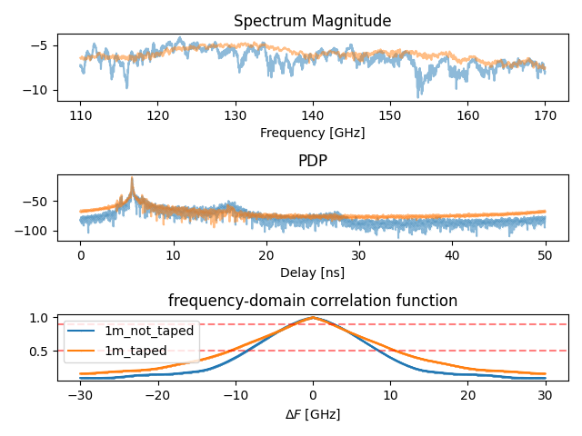

## Hardware Measurements per Model

Below are sections for each model to be populated with all available hardware measurements.

---

### 6GTandem system simulator (1.5)
*Hardware measurements:*  
_To be populated_

---

### Stripe model (2.1.2)
*Hardware measurements:*  
_To be populated_

---

### Polymer microwave/sub-THz fiber (2.2)
*Hardware measurements:*  
_No hardware measurements available_

#### PMF: No Tape
*Hardware measurements:*  
See folder: `models/pmf/no_tape/`  
  
**External references:** [Add reference here]  
**Measured by:** [Add name or institution here]  
**Manufactured by:** [Add manufacturer here]

#### PMF: With Tape
*Hardware measurements:*  
See folder: `models/pmf/with_tape/`  
**External references:** [Add reference here]  
**Measured by:** [Add name or institution here]  
**Manufactured by:** [Add manufacturer here]

---

### Booster units (2.3)
*Hardware measurements:*  
_To be populated_

---

### Radio/Booster unit amplifiers (2.3.1)
*Hardware measurements:*  
_To be populated_

---

### RF switches/splitters/combiners (2.3.2)
*Hardware measurements:*  
_To be populated_

---

### Fiber couplers (2.3.3)
*Hardware measurements:*  
See folder: `/models/coupler/`
Two S-parameter files are available. One measured with balun and one measured without.

**External references:** [Add reference here]  
**Measured by:** [Add name or institution here]  
**Manufactured by:** [Add manufacturer here]

---

### Radio units (2.4)
*Hardware measurements:*  
_To be populated_

---

### Phase shifters (2.4.1)
*Hardware measurements:*  
_To be populated_

---

### Radio unit antennas (2.4.2)
*Hardware measurements:*  
_No hardware measurements available (only angle-dependent attenuation/gain)_

---

### Antenna-fiber isolation (cross-talk) (2.4.3)
*Hardware measurements:*  
_To be populated_

---

### Power consumption (PAs and LNAs) (2.4.4)
*Hardware measurements:*  
_To be populated_

---

### Central Unit (CU) (2.5)
*Hardware measurements:*  
_To be populated_

---

### Amplifiers (2.5.1)
*Hardware measurements:*  
_LNA/PA? To be populated_

---

### ADC/DAC (2.5.2)
*Hardware measurements:*  
_To be populated_

---

### Oscillator (2.5.3)
*Hardware measurements:*  
_To be populated_

---

### Mixer (2.5.4)
*Hardware measurements:*  
_To be populated_

---

### Digital BB processing (incl. source/sink) (2.5.5)
*Hardware measurements:*  
_To be populated_

---

### Power consumption (2.5.6)
*Hardware measurements:*  
_To be populated_

---

### Sub-THz wireless channel (3.1)
*Hardware measurements:*  
_To be populated_

---

### Sub-10GHz wireless channel (3.2)
*Hardware measurements:*  
_To be populated_

---

### Combined sub-THz/sub-10GHz (3.3)
*Hardware measurements:*  
_To be populated_

---

### Traffic models for different use cases (4.2)
*Hardware measurements:*  
_To be populated_

---

### XR Mobility Dataset (4.3)
*Hardware measurements:*  
_To be populated_

---

### Antennas (5.3)
*Hardware measurements:*  
See folder: `/antenna/`
The antenna consists of multiple antenna elements. Every element was measured separately and its pattern can be found
in element1-4.csv. The combined pattern is available in combined.csv

**External references:** [Add reference here]  
**Measured by:** [Add name or institution here]  
**Manufactured by:** [Add manufacturer here]

---

### Power consumption (UE) (5.4)
*Hardware measurements:*  
_To be populated_